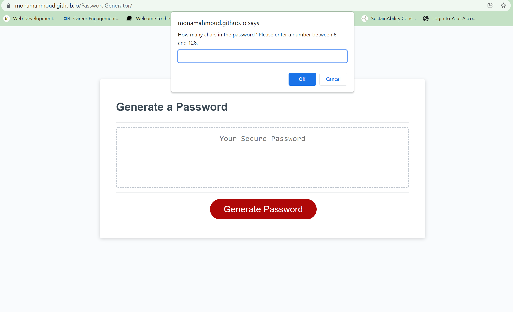
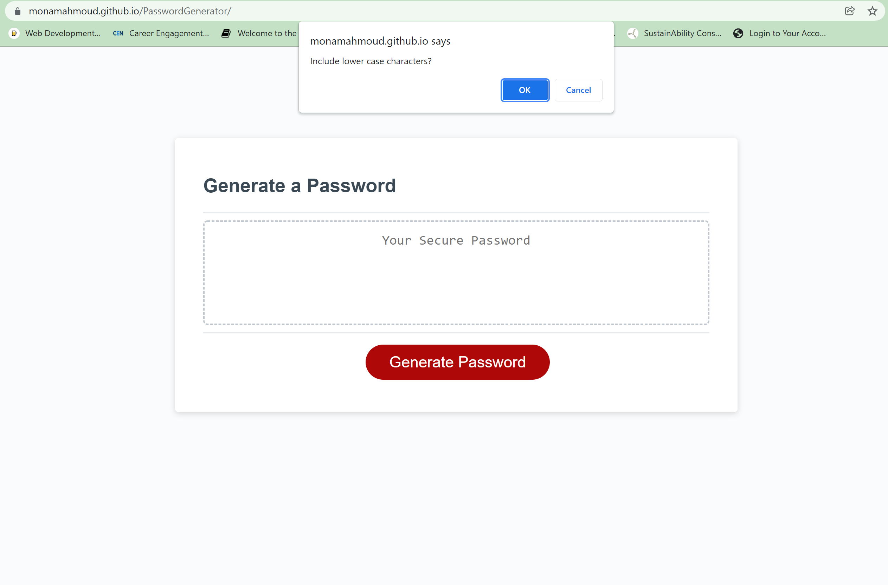
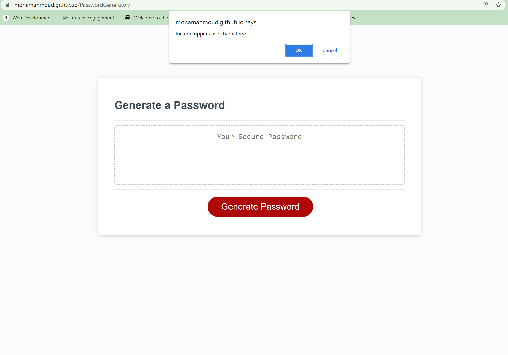
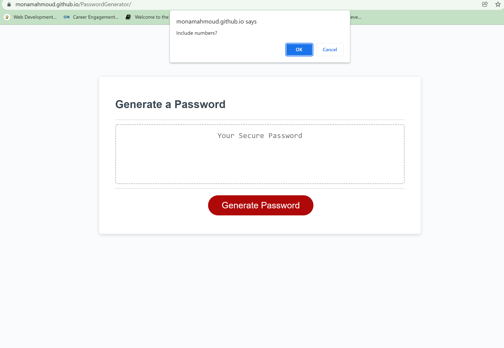
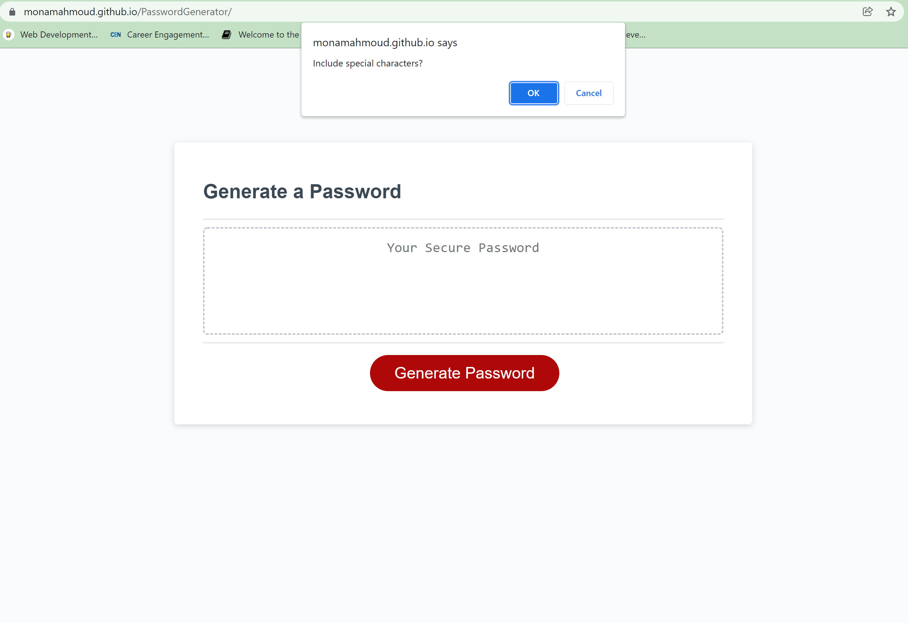
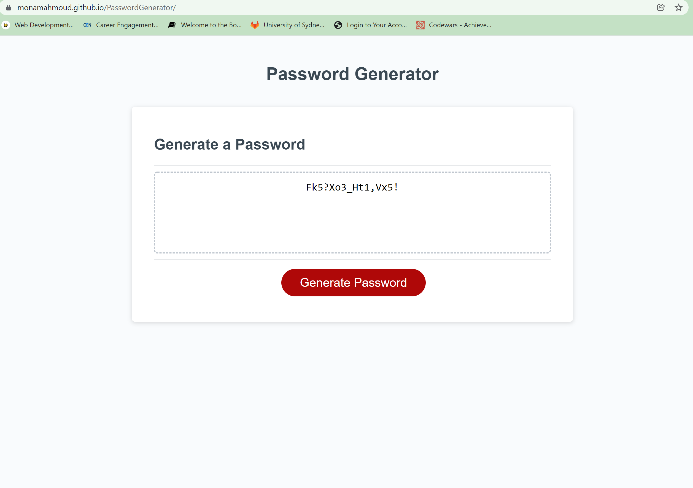

# Password Generator

## Description

The web page generates a password according to criteria provided by the user. User has to define the number of characters of the password as well as to choose at least one option for the type of characters included in password. Available types are uppercase, lowercase, numbers, and special characters.
-
## Table of Contents

- [Installation](#installation)
- [Usage](#usage)
- [Tests](#tests)

## Installation

Open the generator inside the browser using the URL: https://monamahmoud.github.io/PasswordGenerator/

Click the "Generate Password" button to input required password length and start selecting the password parameters.

## Usage

User will be prompted to provide password criteria as in these screenshots:

 

   

   

   

   

   
This is an example of a generated password consisting of 16 characters and including all options: upper, lower, numeric, and special characters:   

   

## Tests

1. Provide a non numeric value for the password length.
2. Provide a number less than 8 for password length.
3. Provide a number larger than 128 for password length.
4. Decline to include all options of the password characters.
5. Try different combinations of the options for the password characters, i.e. upper only, upper and lower, numeric and special... etc 
